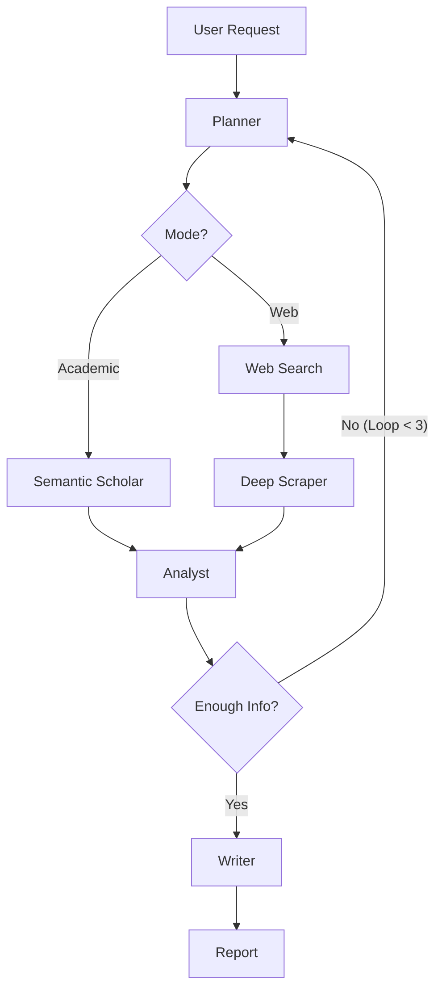

# 🧠 InsightFlow V2: Advanced Agentic Research Engine

> **"Digital assistants that help college students or professionals with their research."**

InsightFlow is a **Production-Grade Cognitive Agent** designed for deep, autonomous research. Unlike linear RAG systems, it uses a **Cyclic State Machine (LangGraph)** to plan, research, critique its own findings, and self-correct—mimicking a senior human researcher.


## 🚀 The "Agentic" Difference

Most AI wrappers are linear (`Input -> Search -> Answer`). InsightFlow is **Cyclic**.

### 1. 🧠 Cognitive Architecture (The Loop)
The agent doesn't just fetch data; it **thinks**.
- **Planner**: Breaks vague queries ("Future of AI") into specific executable strategies.
- **Gatherer**: Context-aware routing.
    - *Web Mode*: Uses **Tavily** + **Deep Scraping** for market research.
    - *Academic Mode*: Uses **Semantic Scholar** to filter for peer-reviewed papers (impact factor > 50).
- **Analyst (Reflexion)**: Reads the data and asks: *"Is this enough?"*
    - If **No**: It loops back (`Loop Count < 3`) with new, refined queries.
    - If **Yes**: It proceeds to the Writer.

### 2. 🛡️ Enterprise Reliability
Built to prove that AI can be trusted in high-stakes environments (e.g., Accounting, Law).
- **Anti-Hallucination**: Strict prompt engineering forbids inventing citations. "No data" is a valid answer.
- **Type Safety**: Replaced dangerous `eval()` with **Pydantic** models. Outputs are guaranteed valid JSON.
- **Resilience**: Implemented **Exponential Backoff** for API rate limits (handles 429 errors gracefully).

### 3. 👁️ Transparent Cortex UI (New in V2)
We don't hide the AI's logic. We visualize it.
- **Neural Stream**: A real-time terminal showing the agent's internal monologue ("🤖 Planner: Analyzing...", "🌍 Network: GET 200 OK").
- **Live State Pulse**: Visual indicators show exactly which specialized agent is active.

---

## 🏗️ Architecture



## 🛠️ Tech Stack

- **Orchestration**: LangGraph (Cyclic State Management)
- **Backend**: FastAPI (Python 3.11), Pydantic
- **Frontend**: Next.js 14, TailwindCSS, Glassmorphism UI
- **Search**: Tavily API (Web), Semantic Scholar API (Academic)
- **Model**: OpenRouter / Groq (Llama 3 / GPT-4)

---

## ⚡ Quick Start

### Prerequisites
- Node.js 18+
- Python 3.11+
- API Keys: OpenRouter, Tavily

### Installation

```bash
# 1. Clone
git clone https://github.com/zakejabar/insightflow.git
cd insightflow

# 2. Backend Setup
cd backend
python -m venv venv
source venv/bin/activate
pip install -r requirements.txt
cp .env.example .env  # Add your API Keys!

# 3. Frontend Setup
cd ../frontend
npm install

# 4. Run System
# Terminal A (Backend)
cd backend && python main.py

# Terminal B (Frontend)
cd frontend && npm run dev
```

Visit `http://localhost:3000` to start your research engine.

---

## 👨‍💻 Author

**Zahir Jabar**
- *AI Engineer specialized in Agentic Systems*
- [LinkedIn](https://www.linkedin.com/in/zahir-jabar-7b7944281/)
- [Portfolio](https://github.com/zakejabar)

> *"Reliability is not an accident. It is an architecture."*
